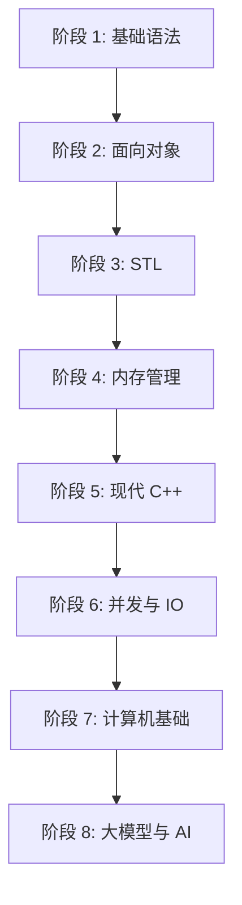

# C++ 学习路线(2026)

## 核心结论

2026 年学 C++,和 5 年前学 C++ 完全是两回事。5 年前把 C++ 八股背熟,操作系统网络搞明白,大厂基本稳了。**现在面试官一边问虚函数表,一边问"了解 Agent 吗",一边还问"你平时用什么 AI 编程工具"**。C++ 仍然重要,但只靠 C++ 八股已经不够了。这份学习路线覆盖 8 个阶段,把 2026 年 C++ 开发者该学的东西一次性理清楚。

## 八阶段学习路线

### 阶段 1:C++ 基础与语法(地基)

| 知识点 | 对应 Wiki 文章 |
|--------|--------------|
| 三大特性(封装、继承、多态) | [封装](/notes/封装.html)、[继承](/notes/继承.html)、[多态](/notes/多态.html) |
| 指针与引用 | [指针 vs 引用](/notes/指针-vs-引用.html) |
| struct vs class | [struct vs class](/notes/struct-vs-class.html) |
| static vs const | [static vs const](/notes/static-vs-const.html) |
| extern "C" | [extern C](/notes/extern-c.html) |
| volatile | [volatile](/notes/volatile.html) |
| inline vs 宏 | [inline vs 宏](/notes/inline-vs-宏.html) |
| auto vs decltype | [auto vs decltype](/notes/auto-vs-decltype.html) |
| sizeof vs strlen | [sizeof 与 strlen 的区别](/notes/sizeof-与-strlen-的区别.html) |
| 浮点数比较 | [浮点数比较](/notes/浮点数比较.html) |
| 变量作用域 | [变量作用域](/notes/变量作用域.html) |
| 四种类型转换 | [类型转换](/notes/类型转换.html) |

**学习建议**:不要只背结论。比如"指针和引用的区别",大多数人能说出 3 条,面试官追问"引用底层怎么实现的"就卡住了。**每个知识点都要问自己:底层怎么实现的?为什么这么设计?**

### 阶段 2:面向对象(必考重灾区)

| 知识点 | 对应 Wiki 文章 |
|--------|--------------|
| 构造函数 | [构造函数](/notes/构造函数.html) |
| 虚析构函数 | [虚析构函数](/notes/虚析构函数.html) |
| 重载与重写 | [重载 vs 重写](/notes/重载-vs-重写.html) |
| 多态机制 | [C++ 多态的实现机制](/notes/c++-多态的实现机制.html)、[多态](/notes/多态.html) |
| 虚函数 vs 纯虚函数 | [虚函数 vs 纯虚函数](/notes/虚函数-vs-纯虚函数.html) |
| 虚函数表 | [虚函数实现机制](/notes/虚函数实现机制.html) |
| 多重继承与菱形继承 | [多重继承与菱形继承](/notes/多重继承与菱形继承.html) |
| 深拷贝 vs 浅拷贝 | [深拷贝 vs 浅拷贝](/notes/深拷贝-vs-浅拷贝.html) |
| this 指针 | [this 指针](/notes/this-指针.html) |
| 单例模式 | [C++ 单例模式](/notes/c++-单例模式.html) |

**学习建议**:**虚函数表是这一阶段的灵魂**。搞不懂虚函数表,多态就是背的,不是理解的。画一张虚函数表的内存布局图,自己推导一遍多态调用的过程,面试时才能说清楚。

### 阶段 3:STL 与容器(工程基础)

| 知识点 | 对应 Wiki 文章 |
|--------|--------------|
| 六大组件 | [STL Allocator 机制](/notes/stl-allocator-机制.html) |
| vector 底层 | [vector 底层原理和扩容机制](/notes/vector-底层原理和扩容机制.html) |
| map vs unordered_map | [map vs unordered_map](/notes/map-vs-unordered_map.html)、[unordered_map 的 rehash 机制](/notes/unordered_map-的-rehash-机制.html) |
| map/deque/list 底层 | [map_deque_list 底层实现](/notes/map_deque_list-底层实现.html) |
| 容器选型 | [STL 容器选型](/notes/stl-容器选型.html) |
| 迭代器失效 | [迭代器失效](/notes/迭代器失效.html) |
| push_back vs emplace_back | [pushback vs emplaceback](/notes/pushback-vs-emplaceback.html) |
| 仿函数 vs Lambda | [仿函数 vs Lambda 性能](/notes/仿函数-vs-lambda-性能.html) |

**学习建议**:不要只记"vector 底层是数组"这种结论。**要搞清楚扩容的时候发生了什么——内存分配、元素搬移、旧内存释放,这些细节面试官最爱追问**。

### 阶段 4:内存管理(C++ 最值钱的地方)

| 知识点 | 对应 Wiki 文章 |
|--------|--------------|
| 内存分区 | [堆 vs 栈](/notes/堆-vs-栈.html) |
| 堆 vs 栈 | [堆 vs 栈](/notes/堆-vs-栈.html) |
| new vs malloc | [new vs malloc](/notes/new-vs-malloc.html) |
| delete vs free | [free 与 delete 的区别](/notes/free-与-delete-的区别.html) |
| placement new | [placement new](/notes/placement-new.html) |
| 内存泄漏/野指针/越界 | [内存泄漏、野指针和内存越界](/notes/内存泄漏野指针和内存越界.html) |
| 内存碎片与溢出 | [内存碎片](/notes/内存碎片.html)、[内存碎片与内存溢出](/notes/内存碎片与内存溢出.html) |
| 智能指针 | [智能指针](/notes/智能指针.html)、[智能指针实现原理](/notes/智能指针实现原理.html) |
| 智能指针线程安全 | [智能指针的线程安全](/notes/智能指针的线程安全.html) |
| RAII | [RAII 机制](/notes/raii-机制.html) |
| 自旋锁 vs 互斥锁 | [自旋锁 vs 互斥锁](/notes/自旋锁-vs-互斥锁.html) |

**学习建议**:**内存管理是 C++ 面试的"照妖镜"**。Java 选手说"我不用管内存",C++ 选手必须能说清楚什么时候分配、什么时候释放、出了问题怎么排查。智能指针不是"会 unique_ptr 和 shared_ptr 的区别"就够了,要能说清楚引用计数怎么实现、循环引用怎么解决。

### 阶段 5:现代 C++(C++11 之后)

| 知识点 | 对应 Wiki 文章 |
|--------|--------------|
| C++11 新特性 | [C++11 新特性](/notes/c++11-新特性.html) |
| 左值引用 vs 右值引用 | [左值引用 vs 右值引用](/notes/左值引用-vs-右值引用.html) |
| 移动语义 | [移动语义](/notes/移动语义.html) |
| 完美转发 | [完美转发](/notes/完美转发.html) |
| std::move vs std::forward | [stdmove vs stdforward](/notes/stdmove-vs-stdforward.html) |
| lambda 表达式 | [lambda 表达式](/notes/lambda-表达式.html) |
| 异常处理 | [异常处理机制](/notes/异常处理机制.html) |
| 协程 | [协程](/notes/协程.html) |

**学习建议**:移动语义是这一阶段的重点。**很多人以为 `std::move` 是移动,其实它什么都没移动,只是做了一个类型转换**。搞清楚这个,移动语义就通了一半。

### 阶段 6:并发与 I/O(后端必修)

| 知识点 | 对应 Wiki 文章 |
|--------|--------------|
| 多线程基础 | [多线程与锁](/notes/多线程与锁.html) |
| 自旋锁 vs 互斥锁 | [自旋锁 vs 互斥锁](/notes/自旋锁-vs-互斥锁.html) |
| C++11 多线程 | [多线程与锁](/notes/多线程与锁.html)、[C++11 新特性](/notes/c++11-新特性.html) |
| select/poll/epoll | [select poll epoll 区别](/notes/select-poll-epoll-区别.html) |
| 协程 | [协程](/notes/协程.html) |

**学习建议**:epoll 是 Linux 后端面试的高频考点。**不要只背"epoll 用红黑树管理 fd"这种结论,要能说清楚 ET 和 LT 模式的区别、为什么 epoll 比 select 高效、什么场景用哪个**。

### 阶段 7:计算机基础(C++ 开发者必修)

虽然不是 C++ 本身的内容,但 C++ 岗位面试对计算机基础的追问深度不亚于 Java 岗:

- **操作系统**:进程/线程、调度、内存管理、文件系统
- **计算机网络**:TCP/IP、HTTP、socket 编程
- **数据库**:索引(B+树)、事务、隔离级别、Redis

**学习建议**:这些和 C++ 内存管理、并发编程是**串在一起**的,不是孤立的知识点。

### 阶段 8:大模型与 AI 编程(2026 必修)

5 年前不存在的内容,但 2026 年不会这些,面试直接吃亏。

#### 8.1 大模型基础认知

- 大模型基本概念(Prompt、Token、上下文窗口、幻觉)
- Function Calling 和 Structured Output
- RAG 基本原理
- Agent 是什么

#### 8.2 AI 编程与 Vibe Coding

- AI 编程产品的三层架构(模型、Agent 内核、产品外壳)
- Vibe Coding 不是让 AI 随便写,是让 AI 在你的工程约束下写
- Token 成本控制、上下文管理、Prompt 优化

#### 8.3 C++ 开发者的 AI 场景

**C++ 在大模型领域有天然优势**,因为推理部署、性能优化、底层算子全是 C++ 的活:

- 模型推理部署(ONNX Runtime、TensorRT)
- KV Cache 原理(和 C++ 内存管理思维一脉相承)
- CUDA 编程基础(C++ 语法 + GPU 并行)
- 大模型服务化(C++ 高性能推理服务)

面试官问"你对大模型有什么了解",如果你能从 C++ 推理部署的角度切入,**比那些只会说"我用过 ChatGPT"的候选人强太多了**。

## 学习节奏建议

### 在校学生(6-8 个月)

| 月份 | 阶段 | 内容 |
|------|------|------|
| 1-2 月 | 第 1-2 阶段 | 基础与面向对象 |
| 3 月 | 第 3-4 阶段 | STL 与内存管理 |
| 4 月 | 第 5-6 阶段 | 现代 C++ 与并发 |
| 5 月 | 第 7 阶段 | 计算机基础 |
| 6 月 | 第 8 阶段 + 项目 | 大模型 + 项目实战 |
| 7-8 月 | 收尾 | 刷面经、模拟面试 |

### 在职转行(8-12 个月)

每天 2-3 小时,节奏放慢,但**每个阶段不要跳过**。计算机基础可以和 C++ 内容交叉着学,不要堆到最后。

## 几个忠告

### 1. 不要跳阶段

没搞懂面向对象就去学 STL,没搞懂内存管理就去学智能指针,结果就是每个阶段都半吊子。

### 2. 不要只看不动手

每个阶段至少写 1-2 个小项目:

- 学完 STL 写个简易容器
- 学完并发写个线程池
- 学完网络写个简易 HTTP 服务器

### 3. 不要忽视计算机基础

C++ 开发者对操作系统和网络的理解深度,直接决定了你的天花板。

### 4. 不要觉得大模型和 C++ 没关系

2026 年的 C++ 岗位,大模型已经是面试必考项,不是加分项。

## 知识图谱索引

按 8 个阶段重新索引所有 Wiki 文章:

## 相关文章清单

- [C++11 新特性](/notes/c++11-新特性.html) - 阶段 5 必读
- [C++ 多态的实现机制](/notes/c++-多态的实现机制.html) - 阶段 2 核心
- [vector 底层原理和扩容机制](/notes/vector-底层原理和扩容机制.html) - 阶段 3 高频考点
- [智能指针实现原理](/notes/智能指针实现原理.html) - 阶段 4 必会
- [移动语义](/notes/移动语义.html) - 阶段 5 难点
- [select poll epoll 区别](/notes/select-poll-epoll-区别.html) - 阶段 6 高频
- [协程](/notes/协程.html) - 阶段 5-6 进阶